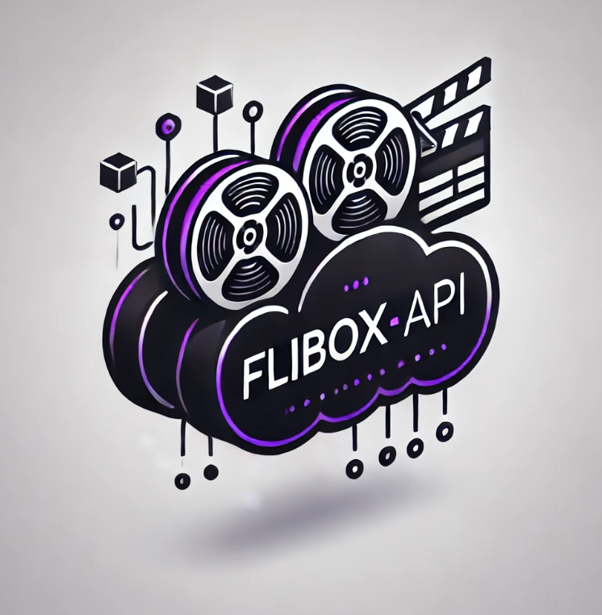

# 🎬 **Сервис для управления фильмами** 🎬



Добро пожаловать в **Сервис для управления фильмами**! 🚀

Это мощное серверное решение для управления всем, что связано с фильмами: от коллекций фильмов и данных пользователей до рекомендаций и продвинутых функций для создания идеального кинематографического опыта. Независимо от того, создаете ли вы или используете данные о фильмах, этот сервис позаботится обо всем! 🍿

## 📝 **О проекте**

**Сервис для управления фильмами** — это современный и высокомасштабируемый сервер, предназначенный для работы с фильмами и связанными данными:

- 📽 **Управление фильмами**: Добавляйте, обновляйте и управляйте фильмами с метаданными, такими как жанры, рейтинги, постеры и многое другое.
- 🎞 **Фильмовые коллекции**: Группируйте фильмы в коллекции для удобного просмотра и организации.
- 👤 **Управление пользователями**: Работа с аутентификацией пользователей, их профилями, избранными фильмами и многим другим.
- 🎯 **Рекомендации**: Предоставляйте персонализированные рекомендации для пользователей на основе их предпочтений и истории просмотров.
- 💬 **Комментарии и взаимодействия**: Позвольте пользователям оставлять комментарии и оценивать фильмы, создавая динамичное и увлекательное взаимодействие.
- 🔒 **Безопасность**: Аутентификация с использованием JWT и управление доступом на основе ролей для обеспечения безопасности данных.

## ⚡ **Ключевые особенности**

- **Масштабируемый API**: Построен с использованием современных технологий для высокой производительности и масштабируемости.
- **Данные о фильмах**: Полное управление фильмами, включая сиквелы, похожие фильмы и интеграцию с внешними источниками данных о фильмах.
- **Профили пользователей и рекомендации**: Создание персонализированных рекомендаций для пользователей на основе их предпочтений.
- **Коллекции**: Создавайте и управляйте коллекциями фильмов для пользователей.

## **Сервис написан с помощью своей реализации DI контейнера🚀🚀🚀**

## 🔧 **Используемые технологии**

- **Golang**: Сервер написан на Go для высокой скорости, простоты и эффективности.
- **Fiber**: Быстрое и гибкое веб-окружение для построения API.
- **JWT-аутентификация**: Безопасная аутентификация и авторизация пользователей с помощью JSON Web Tokens.
- **GORM**: ORM для эффективного управления базой данных и миграциями.
- **gRPC**: Высокопроизводительное взаимодействие между микросервисами (система рекомендаций).
- **S3-хранение**: Безопасное и масштабируемое хранение файлов для изображений, постеров и медиа.

## 🚀 **Как начать**

Чтобы начать работу с **Backend Server**, выполните следующие шаги:

### 1. Клонируйте репозиторий

```bash
git clone https://github.com/1Storm3/kinopoisk-api.git
cd kinopoisk-api
```

### 2. Установите зависимости
```bash
go mod tidy
```

### 3. Запустите сервер

```bash
go run main.go
```

🎯 Планируемые функции

Мы постоянно развиваем проект! Вот что планируется добавить в ближайшее время:

- 📡 Сервис рекомендаций: Продвинутая персонализированная система рекомендаций, основанная на машинном обучении(90% готово).
- 🔒 Управление доступом на основе ролей: Подробное управление разрешениями для пользователей и ролей.
- 🌐 Многоязычная поддержка: Перевод данных о фильмах и интерфейса на разные языки для международных пользователей.
- 📊 Аналитика: Добавление инструментов для анализа вовлеченности пользователей и популярности фильмов.
- 📝 Swagger документация: Добавление Swagger документации для удобства использования API(5% готово).
 
🔒 Лицензия 

Этот проект лицензируется под MIT License — см. файл LICENSE для подробностей.

💬 Контакты

Если у вас есть вопросы или нужна поддержка, не стесняйтесь обращаться:

- Email: 1storm3dev@gmail.com

- Telegram: @StormEV
